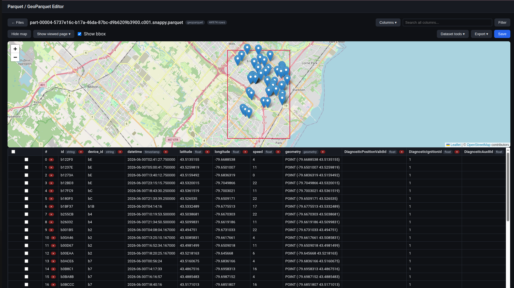

# Parquet / GeoParquet Editor

A web service for viewing and editing `.parquet`/`.geoparquet` files: manual cell editing
that respects each column's type, auto-generation of values by range/list, and viewing
geoparquet geometries on a map (Leaflet).



## Stack

- **Backend**: FastAPI, pandas/pyarrow (plain parquet), geopandas/shapely (geoparquet).
- **Frontend**: React + TypeScript + Vite, react-leaflet + leaflet-draw for the map.
- **Docker Compose**: `backend` (FastAPI, port 8000) + `frontend` (nginx, serves the
  static build and proxies `/api` to the backend).

## Configuration

Settings live in a single `.env` file at the repo root (copy `.env.example` to `.env`
to get started — `.env` itself is gitignored). It's read by three things:

- **docker-compose** — auto-loaded for `${VAR}` substitution in `docker-compose.yml`
  (host port mapping, storage volume path), and injected into the backend container
  via `env_file:`.
- **Backend** (`backend/app/config.py`, `pydantic-settings`) — reads the same file
  directly for local (non-Docker) runs, or plain environment variables when running in
  a container (which is how docker-compose delivers them — the `.env` file itself isn't
  part of the image).
- **Frontend dev server** (`frontend/vite.config.ts`) — reads it via Vite's `loadEnv` to
  set its own port and API proxy target, so `npm run dev` always points at whatever
  backend port is configured.

| Variable | Default | Used by |
|---|---|---|
| `BACKEND_URL` / `BACKEND_PORT` | `http://localhost` / `8000` | docker-compose host port, Vite dev proxy target |
| `FRONTEND_URL` / `FRONTEND_PORT` | `http://localhost` / `3000` | docker-compose host port, Vite dev server port |
| `CORS_ALLOW_ORIGINS` | `*` | backend CORS middleware (comma-separated list, or `*`) |
| `STORAGE_DIR` | `storage` | backend upload directory (relative to `backend/`, or absolute); also picked up by the docker-compose volume mount |

Add new settings by adding a field to `Settings` in `backend/app/config.py` (with a
default so existing setups keep working) and documenting it in `.env.example`.

## Running it

```bash
docker compose up --build
```

With the example `.env` values: app at http://localhost:3000, API at
http://localhost:8000/api (Swagger UI: http://localhost:8000/docs). Change
`BACKEND_PORT`/`FRONTEND_PORT` in `.env` if those clash with something else on your
machine — no need to touch `docker-compose.yml`.

Uploaded files are stored in `./backend/storage` (mounted as a volume — they survive
container restarts; the folder name follows `STORAGE_DIR` if you change it).

## Local development without Docker

Backend:

```bash
cd backend
python -m venv .venv && source .venv/bin/activate
pip install -r requirements.txt
uvicorn app.main:app --reload --port 8000
```

Frontend (the Vite dev server reads the root `.env` for its own port and to build the
`/api` proxy target — see `frontend/vite.config.ts`):

```bash
cd frontend
npm install
npm run dev
```

## Features

1. **Upload and file list** — drag-and-drop or pick a `.parquet`/`.geoparquet` file;
   a list of uploaded files with size/row/column counts, download, delete.
2. **Manual editing** — double-clicking a cell in the table opens an editor whose input
   type depends on the column's type (number, checkbox, date, WKT text for geometry).
   The value is validated against the column's type on the backend before being applied.
3. **Auto-generate values** — the "Generate values" button opens a dialog where you pick
   columns and set parameters per its type:
   - int/float — `min`/`max`;
   - string — a comma-separated list of values;
   - bool — % of values that are `true`;
   - date/timestamp — a date range;
   - geometry — a bbox (typed in or drawn as a rectangle on the map) — random points are
     generated inside the bbox.
   Generation applies either to all rows or only to the rows checked in the table.
4. **View geometry on a map** — for geoparquet files, the "Map" selector shows the
   geometries of the current page, only the checked rows, or all rows in the file (capped
   at 5000 geometries, with a note if some are omitted) on a Leaflet map.
5. **Save** — edits are applied in memory on the server; the "Save" button writes the
   file back to disk (for geoparquet, the CRS and geo metadata are preserved).
6. **Validate file** — the "Validate file" button shows basic data-quality stats: null
   counts per column, the number of exact duplicate rows, `inf`/`-inf` in numeric
   columns, invalid/empty geometries.
   From the same dialog, for any column with null values (except geometry), you can pick
   a strategy and click "Fill" — gaps are filled from **that column's own existing
   values**, nothing external is used:
   - *mean* / *median* — int/float/date/timestamp only;
   - *most frequent value* (mode) — any type;
   - *random from existing values* — bootstrap-sampling from the column's non-null
     values, which preserves the original distribution better than a constant would.
   Rows that already have a value are left untouched.
7. **Merge files** — in the file list, check 2+ files and click "Merge selected": columns
   are unioned (missing values become null), and the result is saved as a new file. The
   deduplication rule is chosen in the dialog:
   - *exact match across all columns* (default) — a row is a duplicate only if it fully
     matches another row in every column;
   - *by key columns* (e.g. `id`) — rows sharing the same key value are collapsed into
     one: for each column, the first non-null value among the matching rows is kept, so a
     record from one file fills in the gaps of a record from another instead of the row
     being duplicated outright. When two non-null values conflict, whichever was
     encountered first (in the order the files were selected) wins.
   If any of the files is geoparquet, the result is geoparquet too (geometry is
   normalized to a single column/CRS taken from the first geo file).
8. **Add/delete a column** — the "Add column" button creates a new column
   (int/float/string/bool/date/timestamp) with an optional default value applied to all
   rows; the × on a column header in the table deletes it. Adding a geometry column isn't
   supported (that requires fully converting the file to geo).
9. **Export** — the "JSON"/"CSV"/"Parquet" toolbar buttons export the current data in the
   chosen format; the geometry column is always excluded from exports (unlike "Save",
   which keeps it).
10. **Filtering, search, sorting** — the search box matches a substring across all
    columns; the "Filters" button builds column+operator+value rules (the available
    operators depend on the type: `=`/`≠`/`<`/`<=`/`>`/`>=` for numbers and dates,
    `=`/contains/starts-with for strings); clicking a column header sorts by it (clicking
    again reverses direction). All of this works on top of pagination and can be combined
    at the same time.
11. **Dataset bounding box on the map** — for geoparquet files, a "Show dataset bbox"
    checkbox next to the map selector computes the bounding box of the whole geometry
    column and draws it as a rectangle on the map (independent of the map scope, so it
    works even with the map otherwise hidden). The bbox is cached on the server per open
    file so repeated toggles don't rescan the column — the cache is invalidated
    automatically whenever the geometry column is edited, regenerated, or deleted.
12. **Export schema as JSON** — the "Schema (JSON)" toolbar button downloads the file's
    schema (column names, dtypes, kinds, CRS, row count) as a JSON file.
13. **Create a new dataset** — the "Create dataset" button on the file list opens a
    dialog to scaffold a brand-new parquet file: define columns (name + type) by hand, or
    load a schema JSON file (e.g. one produced by "Schema (JSON)" above — only `name`/
    `kind` per column are read, so it round-trips cleanly), plus a row count. The file is
    created with placeholder/randomized values per column's type (ints/floats get a
    default range, strings get `columnname_i` placeholders, booleans are random,
    dates/timestamps are randomized over the last year) — use "Generate values" afterwards
    for real control over the distribution. Geometry columns aren't creatable this way and
    are skipped (reported in the confirmation).

## Current limitations

- Edits live in the backend process's memory until you click "Save"; restarting the
  backend container without saving loses unsaved edits.
- Adding/deleting rows isn't implemented — only editing values in existing rows (per the
  original spec).
- For very large files (millions of rows), loading the whole file into the backend's
  memory can be slow — the service is designed for moderately sized files.
- Merging files with differently-named geometry columns requires the CRSes to be defined
  and compatible for reprojection; for files without a consistent geometry schema the
  result may be unexpected — check the output before saving over important data.
